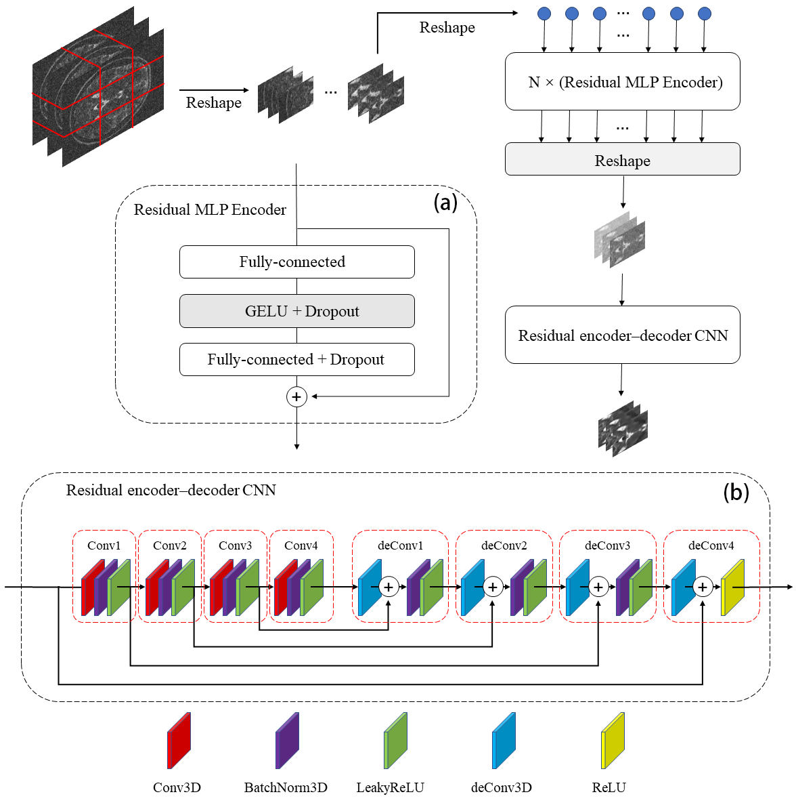
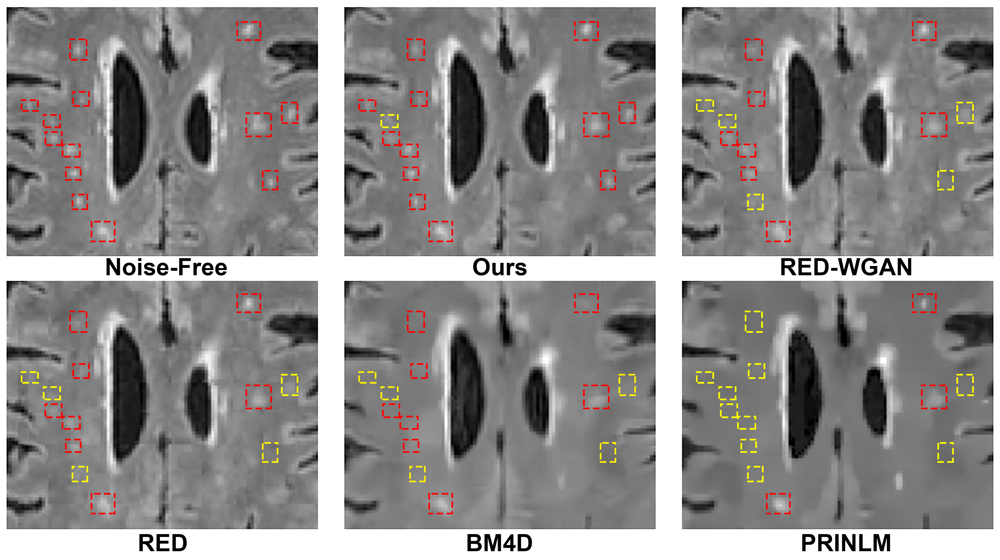

# Denoising of 3D MR images using a voxel-wise hybrid residual MLP-CNN model to improve small lesion diagnostic confidence
PyTorch implementation of *Denoising of 3D MR images using a voxel-wise hybrid residual MLP-CNN model to improve small lesion diagnostic confidence*.

To appear in 25th International Conference on Medical Image Computing and Computer Assisted Intervention (MICCAI 2022).

[[publication]](https://link.springer.com/chapter/10.1007/978-3-031-16437-8_28) [[arxiv]](https://arxiv.org/abs/2209.13818)

If this work is useful to you, please cite our paper:
```
@inproceedings{yang2022denoising,
  title={Denoising of 3D MR Images Using a Voxel-Wise Hybrid Residual MLP-CNN Model to Improve Small Lesion Diagnostic Confidence},
  author={Yang, Haibo and Zhang, Shengjie and Han, Xiaoyang and Zhao, Botao and Ren, Yan and Sheng, Yaru and Zhang, Xiao-Yong},
  booktitle={International Conference on Medical Image Computing and Computer-Assisted Intervention},
  pages={292--302},
  year={2022},
  organization={Springer}
}
```
## Requirements
- Python 3.9.5
- torch 1.9.1+cu111 
- numpy 1.21.4
- scikit-image 0.18.3
- nibabel 3.2.1
## Main Pipeline

## Data Acquisition
Images used in the paper are T2-FLAIR brain MRIs with white matter hyperintensities (WMH) lesions from [UK biobank](http://www.ukbiobank.ac.uk). The dataset is not free, You need to email the official for details.

You can also use other free public dataset of 3D MRI in other modality, such as [IXI Dataset](https://brain-development.org/ixi-dataset/), [ATLAS](https://www.icpsr.umich.edu/web/ADDEP/studies/36684/versions/V3), etc.
## Initialization and Preprocessing
Once you get the data, please convert it into .nii.gz files and put them into ../data/dataset/Free/ fold. Please Name all files in numerical order (like, 1.nii.gz, 2.nii.gz, ...). Please reshape your image matrix into 256 x 256 x 6. If the images come from different machines and the gray values of images vary greatly, normalization for the datast is also necessary

Before you start training, please inital all the folds,  get into ../src/ fold and run the following script.
```
python3 init_files.py
```
After initialization, data preprocessing is needed. You need generate simulated noisy images and reshape each image into patches,  run the following script.
```
python3 preprocessing.py -l [level]
```
Here you can choose which noise level to add into original images. For example, if you want to add 7% noise level, you can run the following script.
```
python3 preprocessing.py -l 7
```
## Train and Validation
To train a model, please run the following script.
```
python mlp_cnn_main.py -cu [cuda num] -l [level] -b [batch size] -e [epoches] -lr [learn rate] -te [trainset end num] -vs [validset start num] -ve [validset end num] 
```
For example, if you want train a modal, setting like: use gpu 0 and gpu 1; use images with 7% noise level for train; batch size is 64; maximum of training epoches is 500; learn rate is 3e-5; training images file name ends in "120.nii.gz"; validation images file name starts from "140.nii.gz"; validation images file name ends in "160.nii.gz". You can run the following script.
```
python mlp_cnn_main.py -cu 0,1 -l 7 -b 64 -e 500 -lr 3e-5 -te 120 -vs 140 -ve 160 
```
Training images file name start from "1.nii.gz" by default. The trained modal is saved in ../src/model/. Evaluation on validation set and loss of each epoch is saved in ../src/loss/.
## Test
To test a model, please run the following script.
```
python mlp_cnn_main.py -cu [cuda num] -l [level] -b [batch size] -vs [Testset start num] -ve [Testset end num] 
```
For example, if you want train a modal, setting like: use gpu 0 and gpu 1; use model trained by images with 7% noise level for test; batch size is 64; test images file name starts from "201.nii.gz"; validation images file name ends in "210.nii.gz". You can run the following script.
```
python mlp_cnn_main.py -cu 0,1 -l 7 -b 64 -vs 201 -ve 210 
```
Denoised images is saved in ../src/result/.
## Result



